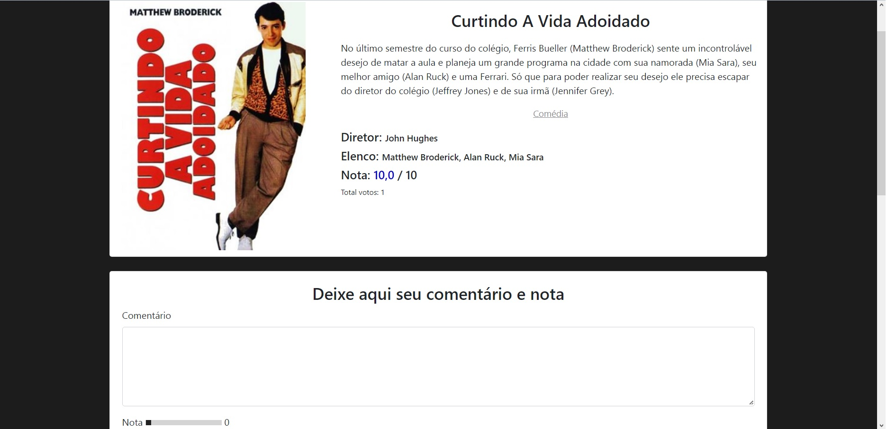
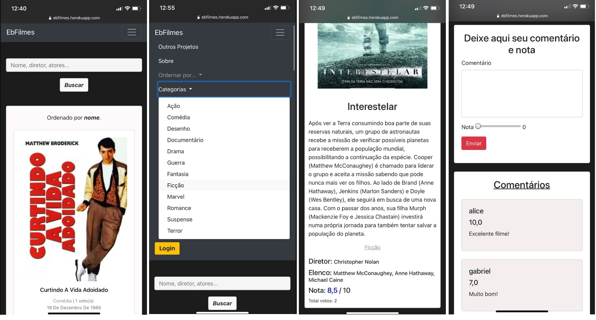

# App EbFilmes
Este repositório trata-se da de uma aplicação web sobre filmes.

# APRESENTACAO
Construir uma aplicação web para que o usuário seja capaz de:
- Visualizar o layout da pagina independente do tamanho da tela do dispositivo;
- Visualizar e ver mais detalhes dos filmes escolhidos;
- Dar nota(s) e emitir comentário(s);
- Visualizar quantidade de votos e nota média dos filmes;
- Ser capaz de realizar um cadastro de usuario;
- Efetuar login com o usuário cadastrado;
- Fazer uma buscas através de nome, diretor ou elenco;
- Fazer buscas por categoria
- Encaminhar e-mail com sugestões e/ou críticas através da seção Sobre;

# METODOLOGIA
Aplicação de conceitos em:
- Python
- Django
- HTML;
- CSS;
- Bootstrap;
- Layouts Responsivos.
- Banco de Dados

# SCREENSHOTS DO PROJETO

# LINK DO PROJETO
Para visualizar o projeto no seu navegador utilize o link abaixo:

https://ebfilmes.herokuapp.com
